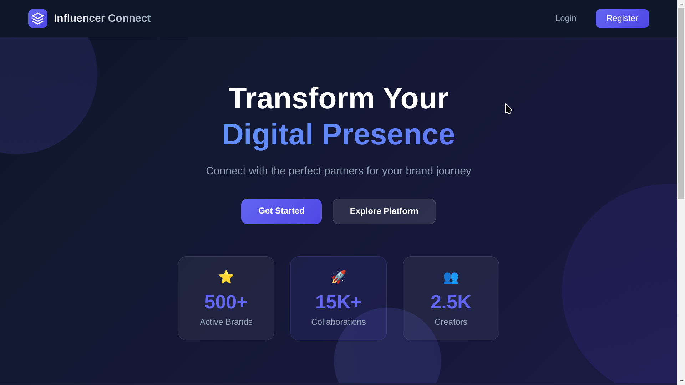
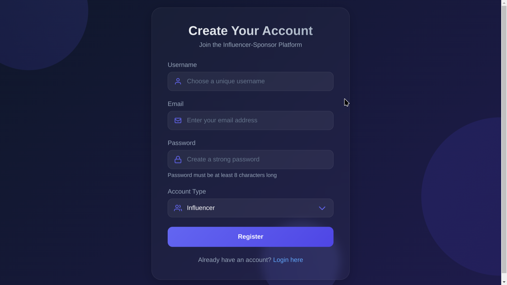
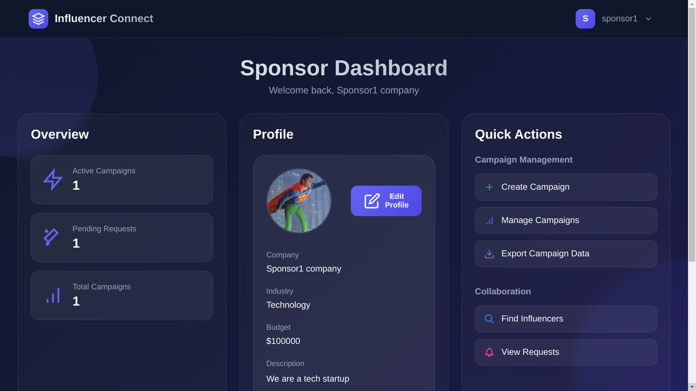
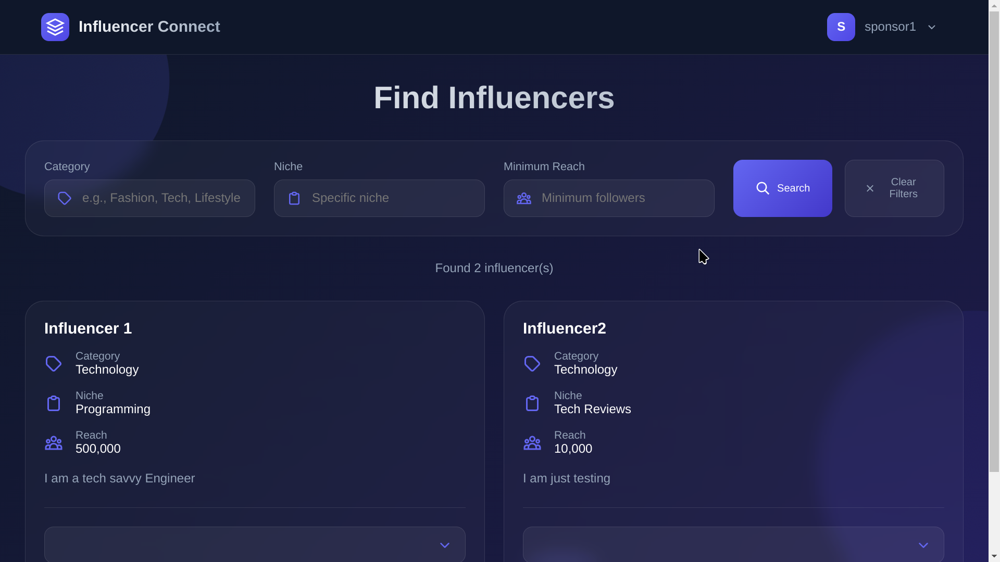
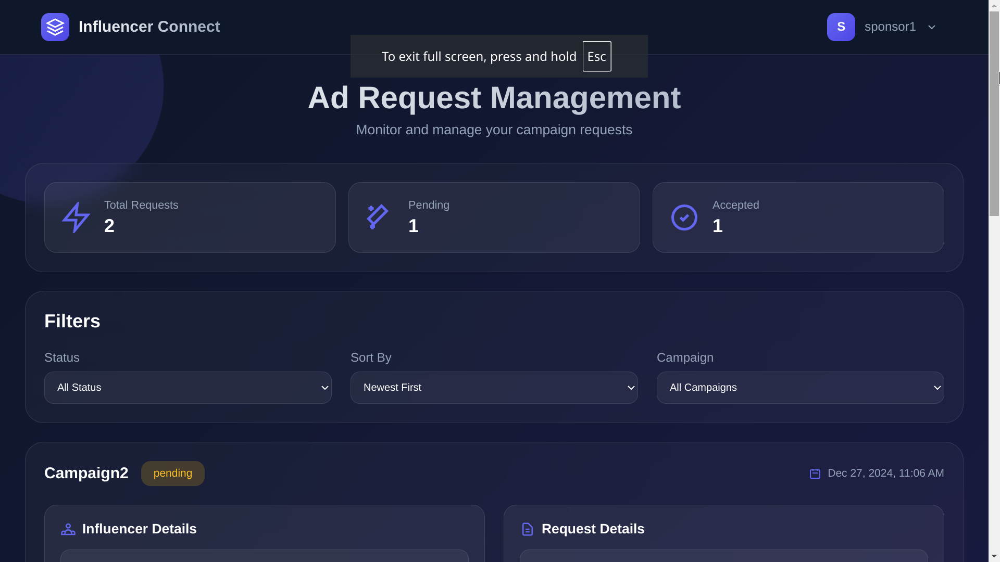
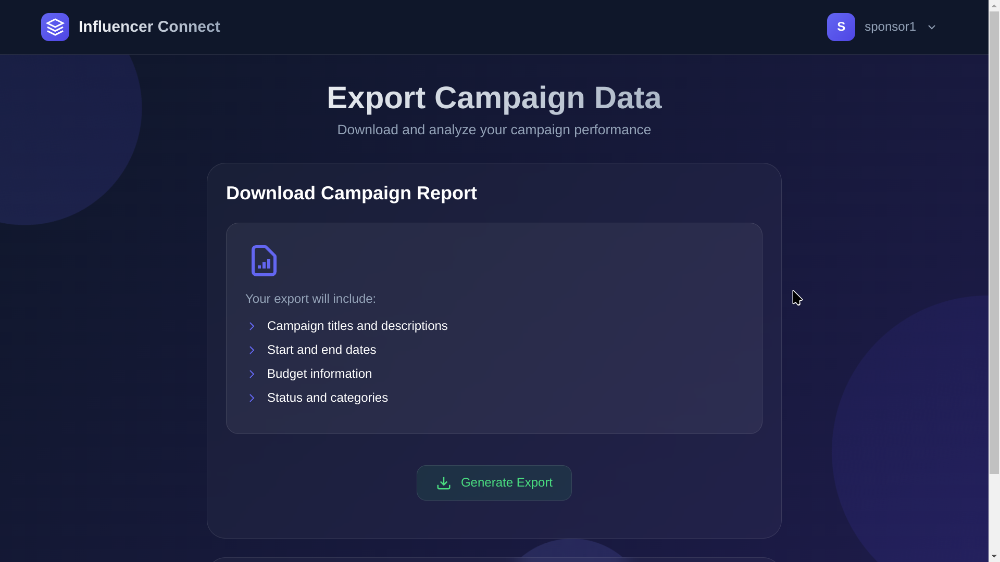
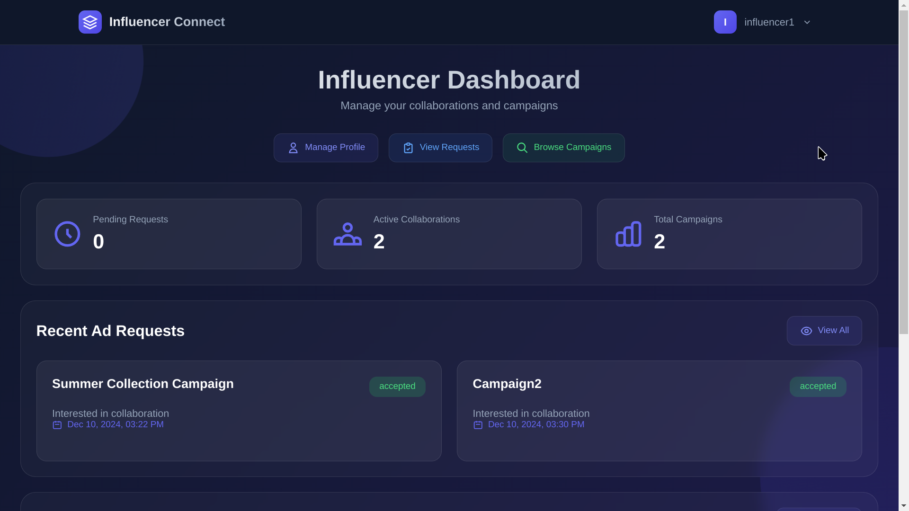

# Influencer-Sponsor Platform

A web application built with Vue.js frontend and Flask backend that connects influencers with sponsors for campaign collaborations.

## Features

### User Authentication
- Role-based authentication (Admin/Sponsor/Influencer)
- JWT token-based security
- Sponsor approval system by admin

### Admin Dashboard
- View platform statistics
- Manage sponsor approvals 
- User management
- Campaign oversight

### Sponsor Features
- Profile management
- Campaign creation & management
- Influencer search & filtering
- Ad request management
- Export campaign data

### Influencer Features 
- Profile management
- Browse campaigns
- Ad request handling
- Contact sponsors

## Installation

### Backend Setup
1. Create and activate virtual environment
```bash
python -m venv venv
source venv/bin/activate  # On Windows: venv\Scripts\activate
```

2. Install Python dependencies
```bash 
pip install -r requirements.txt
```

3. Install and start Redis server (Required for Celery)
For Ubuntu/Debian:
```bash
sudo apt-get install redis-server
sudo service redis-server start
```
For Arch Linux:
```bash
sudo pacman -S redis
sudo systemctl start redis
```

4. Start Celery worker (in a new terminal)
```bash
celery -A app.celery worker --loglevel=info
```

5. Start Flask backend
```bash
python app.py
```

### Frontend Setup
1. Navigate to the frontend directory
```bash
cd influencer-sponsor-frontend
```

2. Install Node.js dependencies
```bash
npm install
```

3. Start Vue development server
```bash
npm run serve
```

## Usage

1. Access the application at `http://localhost:8080`

2. Register as either a Sponsor or Influencer

3. For Sponsors:
   - Wait for admin approval
   - Create and manage campaigns
   - Search for influencers
   - Send collaboration requests

4. For Influencers:
   - Browse available campaigns
   - Accept/reject collaboration requests
   - Contact sponsors

5. For Admin:
   - Approve/reject sponsor registrations
   - Manage users and campaigns
   - View platform statistics

## Built With

- Frontend: Vue.js 2
- Backend: Flask
- Database: SQLite
- Authentication: JWT
- Task Queue: Celery
- Cache: Flask-Caching
- Message Broker: Redis

## Additional Setup

### Email Configuration (Optional)
For testing, use Python's debugging SMTP server:

1. Install aiosmtpd:
```bash
pip install aiosmtpd
```

2. Start debugging server (in a new terminal):
```bash
python -m aiosmtpd -n -l localhost:1025
```

3. Configure mail settings in Flask app:
```python
app.config['MAIL_SERVER'] = 'localhost'
app.config['MAIL_PORT'] = 1025
app.config['MAIL_USE_TLS'] = False
app.config['MAIL_USERNAME'] = None
app.config['MAIL_PASSWORD'] = None
```

## Important Notes

- Ensure Redis server is running before using export functionality
- For production, configure proper email settings
- Use environment variables for sensitive information

## Screenshots  

### **Home Page: Your Gateway to Influencer Marketing**  
The home page of InfluConnect welcomes users with a clean and intuitive design. Built with **Vue.js**, it highlights the platform's core features, making it easy for sponsors and influencers to understand the value of the platform at a glance.  

  

---

### **User Authentication: Secure and Seamless Access**  
InfluConnect ensures secure access with its user-friendly signup and signin pages. Whether you're a sponsor, influencer, or admin, the authentication process is smooth and hassle-free, powered by **JWT token-based security**.  

  
  

---

### **Sponsor Dashboard: Manage Campaigns with Ease**  
The Sponsor Dashboard, built with **Vue.js**, is the control center for sponsors. From here, sponsors can create, manage, and track campaigns, search for influencers, and handle ad requests—all in one place.  

  

---

### **Find Influencers: Discover the Perfect Match**  
Sponsors can search for influencers based on niche, category, and reach. The intuitive filtering system ensures sponsors find the right influencers for their campaigns.  

  

---

### **Ad Request Management: Streamlined Collaboration**  
The Ad Requests feature allows sponsors to send collaboration requests to influencers. Influencers can respond with acceptance, rejection, or negotiation, making the process transparent and efficient.  

  

---

### **Export Campaign Data: Stay Organized**  
Sponsors can export campaign data directly to their email, ensuring they have all the information they need to analyze and optimize their campaigns.  

  

---

### **Influencer Dashboard: Collaborate and Grow**  
The Influencer Dashboard empowers influencers to manage their profiles, browse campaigns, and respond to ad requests. It’s designed to help influencers maximize their reach and engagement.  

  

---

### **Admin Dashboard: Full Control Over the Platform**  
The Admin Dashboard provides administrators with the tools to manage the platform effectively. From user management to campaign oversight, admins have full control to ensure the platform runs smoothly.  

  

---

## Conclusion  

**InfluConnect** is a robust and dynamic platform designed to bridge the gap between sponsors and influencers. Built with **Vue.js** for the frontend and **Flask** for the backend, it delivers a seamless and intuitive user experience. From secure authentication to campaign management and influencer collaboration, InfluConnect showcases the power of modern web development tools. This project not only met but exceeded expectations, earning a perfect score and the title of **Best Capstone Project**. Whether you're a sponsor looking to launch a campaign or an influencer seeking opportunities, InfluConnect is your go-to platform for influencer marketing.  

--- 

For a more detailed walkthrough, check out the [video demonstration](https://drive.google.com/file/d/1HJ_kjRXw1i6052ehF2F-k9T80Iy9VR60/view).